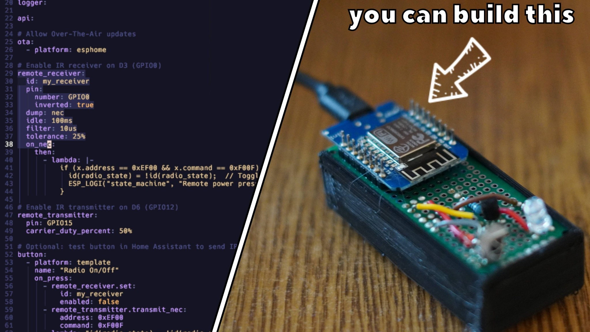

    

        
    

# Keen on Tech – ESP8266 IR Smart Remote

Welcome to the ESP8266 IR Smart Remote project!

This repository contains all the resources you need to build a DIY IR controller that can both receive signals from a remote and send IR commands — fully integrated with ESPHome and Home Assistant.

### Features

- Bidirectional IR support: Receive and transmit IR signals.

- Home Assistant integration: Control any IR device with automations.

- ESPHome configuration: Pre-built YAML files for quick setup.

- DIY-friendly: Easy-to-follow wiring diagrams and code examples.

- Compact hardware design: Based on the ESP8266 (ESP-01 module).

### Hardware Requirements

- ESP8266 ESP-01 (esp01_1M)

- IR Receiver (VS1838B or similar)

- IR LED (940nm)

- 2N2222 NPN transistor

- 100Ω (IR LED current limiting)

- 1kΩ (transistor base)

- Breadboard/PCB & jumper wires

- 5V USB power supply
